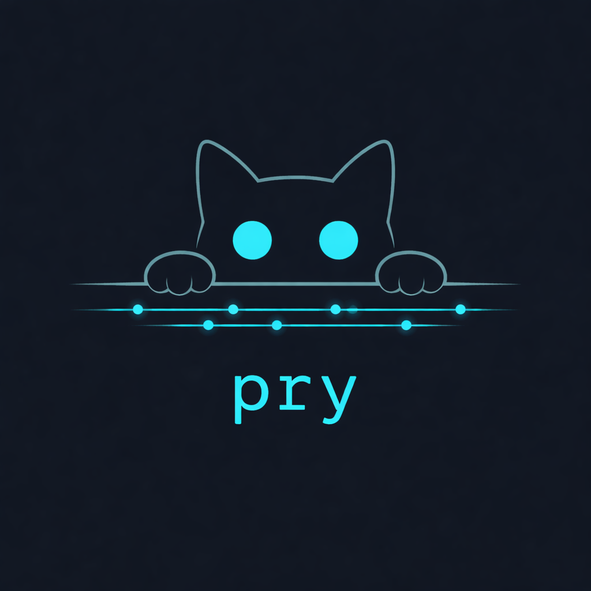

<p align="center">
  
</p>

<p align="center">
  <strong>Proxy HTTP/HTTPS para iOS devs. Swift puro. Un binario. Sin dependencias externas.</strong>
</p>

<p align="center">
  <a href="docs/libro/README.md">Leer el libro</a> •
  <a href="#inicio-rápido">Inicio rápido</a> •
  <a href="docs/libro/05-alternativas.md">Alternativas</a> •
  <a href="ROADMAP.md">Roadmap</a>
</p>

---

## Por qué existe

Existen herramientas excelentes para debuggear tráfico de red — Proxyman, Charles, mitmproxy. Cada una resuelve el problema a su manera y el trabajo que hay detrás merece respeto.

Lo que no existe es una alternativa open source en Swift, liviana, que se integre nativamente en el ecosistema iOS desde la terminal. Sin Python. Sin runtime. Sin UI. Un binario que intercepta, mockea y observa.

```bash
pry start
pry add api.myapp.com
pry mock /api/login '{"token":"abc123"}'
pry log
pry stop
```

## Qué descubrimos

Tres hallazgos que documentamos en el proceso:

**1. Los bytes no fluyen solos.** Después de responder `200 Connection Established` a un CONNECT, SwiftNIO no forwardea bytes automáticamente. Necesitas `leftOverBytesStrategy: .forwardBytes` en el HTTPRequestDecoder y remover handlers sincrónicamente con `syncOperations`. Sin esto, los bytes TLS se parsean como HTTP y crashean. → [Capítulo 3](docs/libro/03-connect-tunnel.md)

**2. El Simulador iOS usa la red de la Mac.** No hay network stack separado. Todo request HTTP/HTTPS del Simulador sale por la interfaz de red de macOS. Configurar un proxy en el sistema intercepta tráfico del Simulador automáticamente. → [Capítulo 1](docs/libro/01-el-problema.md)

**3. HTTPS selectivo es posible.** No necesitas interceptar todo el tráfico TLS. Solo los dominios que el dev pida (`.prywatch`). El resto pasa como túnel transparente — las apps que no te interesan no se rompen. → [Capítulo 4](docs/libro/04-tls-interception.md)

## El libro

Documentamos todo el proceso — los errores, los callejones sin salida, las decisiones. No para vender Pry, para que cualquier ingeniero que quiera construir un proxy tenga un punto de partida.

| Capítulo | Qué encontrarás |
|---|---|
| [01 — El problema](docs/libro/01-el-problema.md) | Qué existe, qué falta, y por qué decidimos construirlo |
| [02 — Arquitectura](docs/libro/02-arquitectura.md) | SwiftNIO pipelines, channel handlers, event loops |
| [03 — CONNECT y el túnel](docs/libro/03-connect-tunnel.md) | GlueHandler, por qué los bytes no fluyen, state machines |
| [04 — TLS interception](docs/libro/04-tls-interception.md) | CA generation, SNI extraction, pipeline MITM |
| [05 — Alternativas](docs/libro/05-alternativas.md) | mitmproxy, Proxyman, Charles — análisis honesto |
| [06 — Decisiones](docs/libro/06-decisiones.md) | Por qué Swift, por qué SwiftNIO, por qué no wrappear mitmproxy |
| [07 — Por qué es libre](docs/libro/07-por-que-es-libre.md) | La deuda con el open source y por qué documentamos los fracasos |

> **[Leer el libro completo →](docs/libro/README.md)**

---

<h2 id="inicio-rápido">Inicio rápido</h2>

```bash
# Compilar
swift build -c release
cp .build/release/pry /usr/local/bin/pry

# Levantar proxy
pry start

# En otra terminal: probar
curl -x http://localhost:8080 http://httpbin.org/get
```

### Mockear endpoints

```bash
pry mock /api/login '{"token":"abc123"}'
pry mock /api/users users.json
curl -x http://localhost:8080 http://anything/api/login
# → {"token":"abc123"}
```

### HTTPS selectivo

```bash
# Agregar dominios a interceptar
pry add api.myapp.com
pry add staging.myapp.com

# Instalar CA en el Simulador iOS
pry trust

# Levantar — intercepta solo lo de la watchlist
pry start
```

### Ver tráfico

```bash
pry log          # Historial de requests
pry list         # Dominios interceptados
pry mocks        # Mocks activos
```

---

## Alternativas

Si tu caso de uso es diferente, estas herramientas pueden ser mejor opción:

| Caso | Herramienta | Por qué |
|---|---|---|
| UI visual completa | [Proxyman](https://proxyman.io) | macOS nativo, SSL proxying, breakpoints |
| Multiplataforma, enterprise | [Charles Proxy](https://www.charlesproxy.com) | Estándar de industria, Java |
| Open source, Python | [mitmproxy](https://mitmproxy.org) | Potente, extensible, UI web |
| Inspección sin proxy | [HTTP Toolkit](https://httptoolkit.com) | Open source, UI multiplataforma |

Análisis completo: [Capítulo 5 — Alternativas](docs/libro/05-alternativas.md)

---

## Bitácora

Diario crudo de desarrollo — cada sesión, cada intento, cada error.

> **[Leer la bitácora →](docs/BITACORA.md)**

---

## Licencia

MIT

---

> *El conocimiento se pudre cuando se guarda. Se mantiene vivo cuando se comparte.* — [Manifiesto](./MANIFESTO.md)
