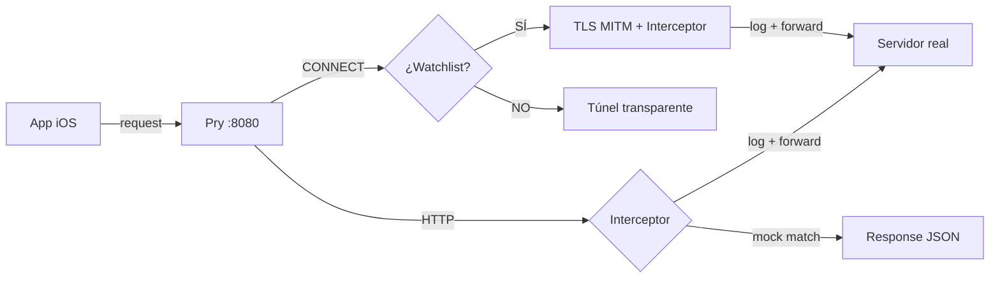

# Capítulo 1 — El problema

## Las herramientas que existen

Para debuggear tráfico de red en iOS hay herramientas excelentes. Proxyman, Charles Proxy, mitmproxy — cada una resuelve el problema a su manera. Son productos con años de desarrollo, comunidades activas y soporte real. El trabajo que hay detrás merece respeto.

Proxyman y Charles son herramientas comerciales con UI pulida y features avanzados. mitmproxy es open source, potente, usado en producción por miles de empresas — pero son más de 50,000 líneas de Python con su propio ecosistema de addons, parsers y UI web.

Lo que no existe es una alternativa open source en Swift, liviana, que se integre nativamente en el ecosistema iOS sin dependencias externas.

## Lo que necesitamos es más simple

```bash
pry start
pry mock /api/login '{"token":"abc123"}'
# ...correr tests...
pry log
pry stop
```

Un binario. Sin Python. Sin runtime. Sin UI. Solo interceptar, ver y mockear.

## Lo que nadie te dice

### El Simulador iOS usa la red de la Mac

Cuando una app en el Simulador hace un request HTTP, ese request sale por la interfaz de red de macOS. No hay un "network stack" separado del Simulador. Esto significa que si configuras un proxy en macOS, el tráfico del Simulador pasa por ahí automáticamente.

Eso es bueno para nosotros — no necesitamos hackear nada para interceptar.

### HTTPS es donde se complica

HTTP es trivial: recibes el request, lo lees, lo forwardeas. Texto plano.

HTTPS requiere que el cliente (la app) confíe en tu certificado. Si no, la conexión falla. Y apps con certificate pinning (bancos, pagos) van a fallar siempre — no hay forma de interceptarlas sin modificar el binario.

La solución: interceptar selectivamente. Solo los dominios que el dev pida. Todo lo demás pasa como túnel transparente.

### SwiftNIO no es simple

SwiftNIO es el framework de networking async de Apple. Es potente, es rápido, es lo que usa Vapor.

Pero construir un proxy con SwiftNIO requiere entender channel pipelines, inbound/outbound handlers, state machines, y el ciclo de vida de un channel. Y cuando algo falla, los bytes simplemente no fluyen — sin error, sin log, sin crash. Solo silencio.

## Lo que decidimos construir

Un proxy CLI en Swift puro con SwiftNIO que:

1. **HTTP**: intercepta, logea, mockea, forwardea
2. **HTTPS**: túnel transparente por defecto, interception selectiva vía watchlist
3. **Cero dependencias externas** más allá de SwiftNIO (Apple, MIT)
4. **Un binario**: compilas, copias, funciona



---

**Siguiente: [Capítulo 2 — Arquitectura](02-arquitectura.md)**
