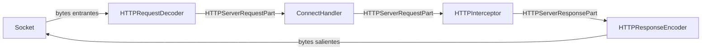
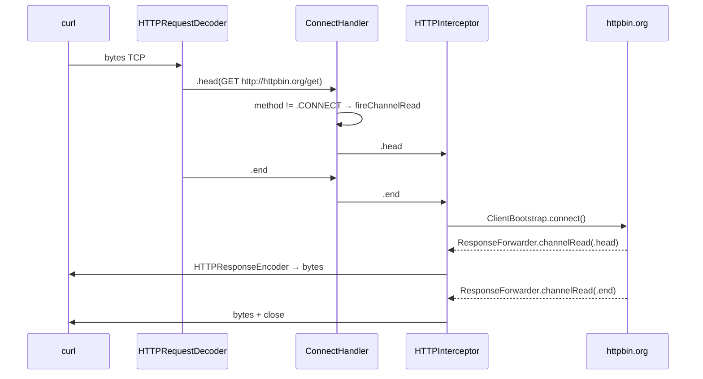
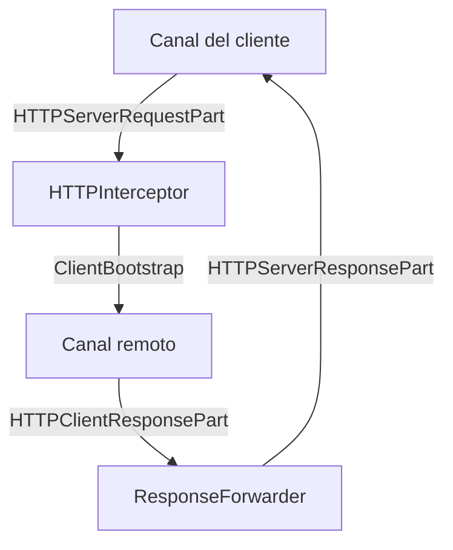
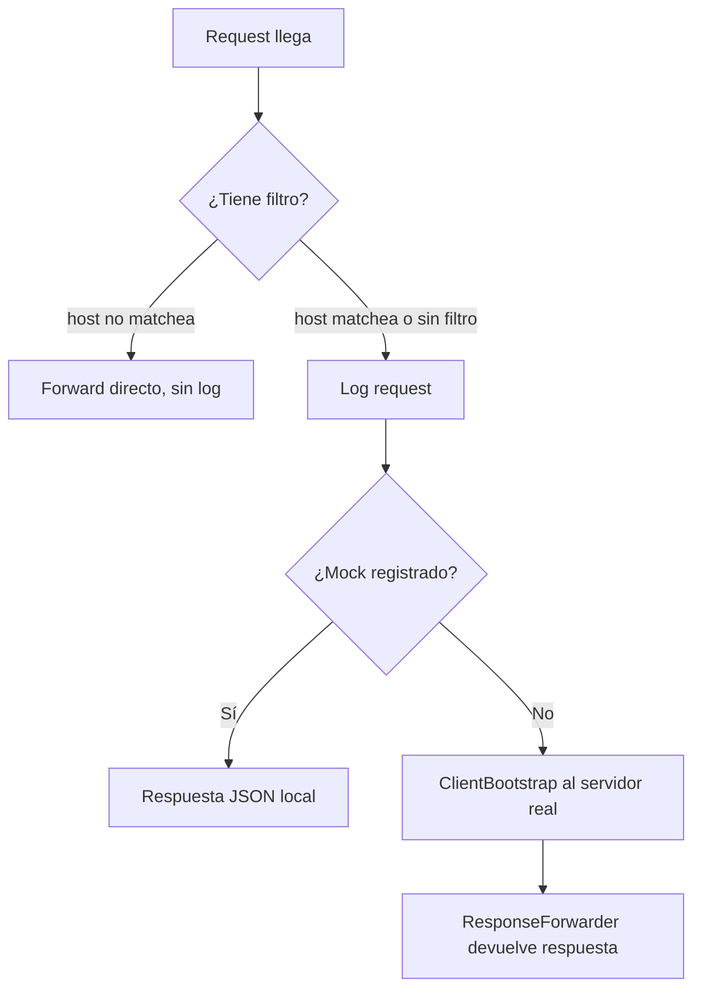

# Capítulo 2 — Arquitectura

## El modelo mental

Antes de ver código, necesitas un modelo mental de cómo funciona SwiftNIO. Sin ese modelo, el código parece magia negra. Con él, todo encaja.

SwiftNIO no es un framework de "request/response" como URLSession o Vapor. Es un framework de **canales y bytes**. No sabe nada de HTTP, TLS, ni WebSockets por defecto. Tú construyes eso encima. Lo que SwiftNIO sí sabe hacer muy bien es mover bytes de forma no-bloqueante usando el loop de eventos del sistema operativo.

## EventLoopGroup: el corazón

Todo empieza con el `EventLoopGroup`. En Pry:

```swift
self.group = MultiThreadedEventLoopGroup(numberOfThreads: System.coreCount)
```

Un `EventLoopGroup` es un pool de threads. Cada thread tiene su propio `EventLoop` — un loop infinito que monitorea file descriptors con `kqueue` (en macOS) o `epoll` (en Linux) y ejecuta callbacks cuando hay actividad.

La clave: **un EventLoop nunca bloquea**. Si necesitas esperar algo (una conexión TCP, datos del socket), registras un callback y el loop sigue con otras conexiones. Cuando llegan los datos, el loop llama tu callback. Esto permite que un solo thread maneje miles de conexiones simultáneas.

Cada canal vive en exactamente un EventLoop. Todo el código de ese canal se ejecuta en ese thread. Sin locks. Sin data races (en teoría).

## ServerBootstrap: la fábrica de canales

`ProxyServer` configura el servidor en `start()`:

```swift
let bootstrap = ServerBootstrap(group: group)
    .serverChannelOption(ChannelOptions.backlog, value: 256)
    .serverChannelOption(ChannelOptions.socketOption(.so_reuseaddr), value: 1)
    .childChannelInitializer { channel in
        channel.eventLoop.makeCompletedFuture {
            try channel.pipeline.syncOperations.addHandler(
                ByteToMessageHandler(HTTPRequestDecoder(leftOverBytesStrategy: .forwardBytes))
            )
            try channel.pipeline.syncOperations.addHandler(HTTPResponseEncoder())
            try channel.pipeline.syncOperations.addHandler(ConnectHandler(ca: ca))
            try channel.pipeline.syncOperations.addHandler(HTTPInterceptor(mocks: mocks, filter: filter))
        }
    }

let channel = try bootstrap.bind(host: "0.0.0.0", port: port).wait()
```

El `ServerBootstrap` escucha en el puerto y, por cada conexión entrante, crea un **canal hijo** (`childChannel`). El `childChannelInitializer` es la fábrica: define qué handlers tiene ese canal. Cada conexión de cliente tiene su propio canal, con su propio pipeline, totalmente aislado.

## Channel y Pipeline: la tubería

Un `Channel` es una abstracción sobre un socket TCP. Tiene un `ChannelPipeline` — una lista ordenada de handlers por donde pasan todos los datos.

Los datos fluyen en dos direcciones:

- **Inbound**: bytes que llegan del cliente → los handlers los procesan de izquierda a derecha
- **Outbound**: respuestas que vas a enviar → los handlers las procesan de derecha a izquierda



Cada handler tiene un `ChannelHandlerContext` — su "ventana" al pipeline. Puede pasar datos al siguiente handler con `context.fireChannelRead()`, escribir respuestas con `context.write()`, o remover handlers del pipeline con `context.pipeline.syncOperations.removeHandler()`.

## Los cuatro handlers iniciales

Cuando una nueva conexión llega, el pipeline tiene exactamente cuatro handlers:

**`ByteToMessageHandler(HTTPRequestDecoder)`** — Toma bytes crudos del socket y los convierte en partes HTTP: `.head` (método + headers), `.body` (cuerpo), `.end` (fin del request). El parámetro `leftOverBytesStrategy: .forwardBytes` es crítico: si el decoder recibe bytes que no son HTTP (como un ClientHello de TLS), en vez de descartarlos los pasa al siguiente handler como bytes crudos. Sin esto, el túnel HTTPS nunca funciona.

**`HTTPResponseEncoder`** — El inverso: toma partes HTTP de respuesta y las serializa en bytes. Vive en la dirección outbound.

**`ConnectHandler`** — Maneja el método HTTP CONNECT. Si llega un request CONNECT, lo intercepta y negocia el túnel. Si llega cualquier otro método (GET, POST), lo pasa al siguiente handler sin tocarlo.

**`HTTPInterceptor`** — Recibe todos los requests HTTP normales. Loguea, revisa mocks, y forwardea al servidor real.

## Cómo fluye un request HTTP

Tomemos el caso más simple: `curl -x http://localhost:8080 http://httpbin.org/get`.



El `ConnectHandler` ve que el método es GET, no CONNECT, y llama `context.fireChannelRead(rawData)` — pasa el mensaje al siguiente handler sin modificarlo.

## Cómo funciona el forwarding

Dentro de `handleRequest()`, el `HTTPInterceptor` usa un `ClientBootstrap` para conectarse al servidor destino:

```swift
ClientBootstrap(group: group)
    .channelInitializer { channel in
        channel.pipeline.addHTTPClientHandlers().flatMap {
            channel.pipeline.addHandler(ResponseForwarder(clientChannel: clientChannel, host: host))
        }
    }
    .connect(host: host, port: port)
```

`ResponseForwarder` cierra el ciclo: cuando el servidor remoto responde, toma esas partes HTTP y las escribe de vuelta en el canal original del cliente.



La asimetría de tipos es importante: el canal remoto habla `HTTPClientResponsePart`, pero el canal del cliente espera `HTTPServerResponsePart`. `ResponseForwarder` hace esa traducción.

## Cómo funciona el mocking

El mock check ocurre antes del forwarding:

```swift
if let mockResponse = findMock(for: path) {
    respondWithMock(context: context, json: mockResponse, path: path)
    return  // No forwardea
}
```

`findMock()` busca por prefijo: `/api/login` matchea `/api/login`, `/api/login/social`, `/api/login?redirect=home`. Cuando hay match, construye una respuesta HTTP 200 directamente en el pipeline, sin abrir ninguna conexión al exterior.

El header `X-Pry-Mock: true` permite que los tests sepan que la respuesta es sintética.



## El sistema de Config

Pry usa archivos de texto plano para persistir estado. El diseño es deliberadamente simple.

**`.pryconfig`** — Vive en el directorio desde donde corres `pry`. Formato `clave=valor`, un par por línea. `#` para comentarios.

**`.prywatch`** — Lista de dominios a interceptar con TLS MITM, uno por línea. Lo gestiona `Watchlist.swift`. Soporta wildcards (`*.myapp.io`).

**`/tmp/pry.log`** — Log persistente. Cada entrada tiene timestamp ISO 8601. Se borra al reiniciar la máquina.

**`/tmp/pry.pid`** — PID del proceso proxy. `pry stop` lo lee para saber a qué proceso enviar SIGTERM.

**`/tmp/pry.mocks`** — Los mocks activos. Formato `path\tJSON`, separados por tab.

```mermaid
graph LR
    A[pry start] -->|escribe| B[/tmp/pry.pid]
    C[pry mock] -->|append| D[/tmp/pry.mocks]
    E[requests] -->|append| F[/tmp/pry.log]
    G[pry stop] -->|lee PID, SIGTERM| B
```

## Qué aprendimos

SwiftNIO es una fábrica de tuberías. Tú defines qué handlers viven en cada tubería y en qué orden. Los datos fluyen por esos handlers, se transforman, y salen al otro lado. La elegancia del modelo está en que puedes remover y agregar handlers en tiempo de ejecución — eso es lo que hace posible la transición de HTTP a túnel TLS en `ConnectHandler`.

El sistema de Config tiene una elegancia silenciosa: archivos de texto plano que cualquier herramienta puede leer. No hay daemon de configuración, no hay base de datos, no hay serialización compleja.

---

**Siguiente: [Capítulo 3 — CONNECT y el túnel](03-connect-tunnel.md)**
