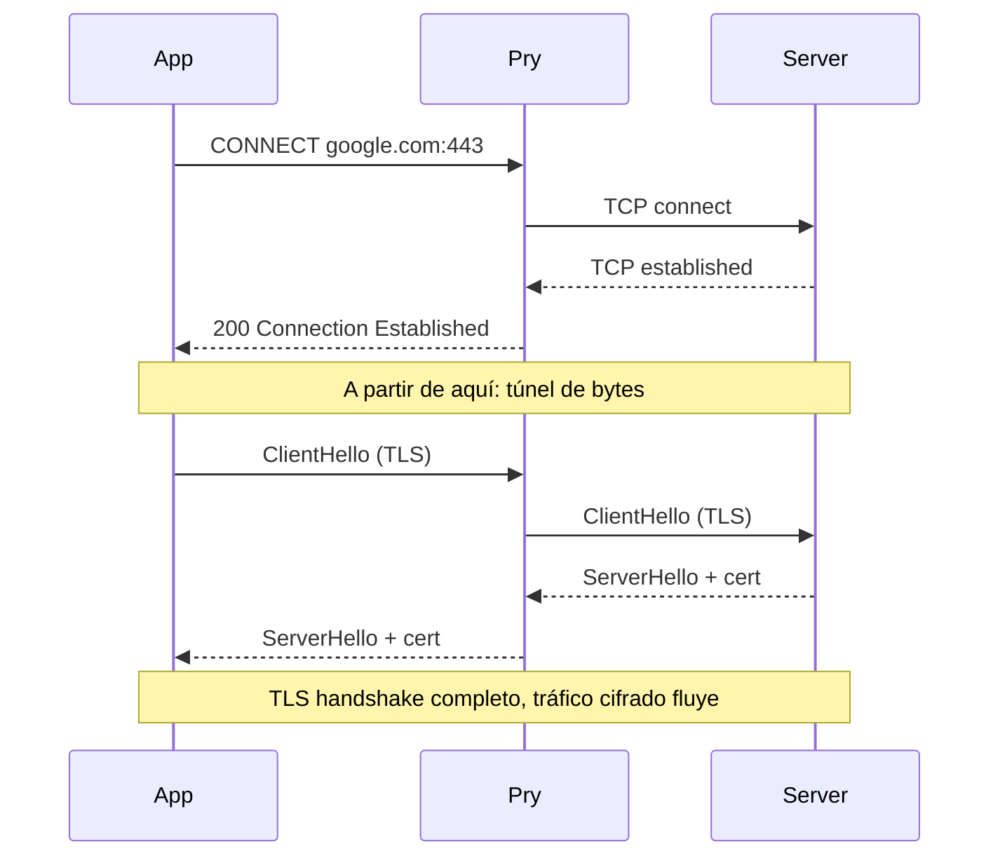

# Capítulo 3 — CONNECT y el túnel

## El método CONNECT

Cuando una app hace un request HTTPS a través de un proxy, no envía el request directamente. Envía primero un request HTTP especial:

```
CONNECT www.google.com:443 HTTP/1.1
Host: www.google.com:443
```

Le está diciendo al proxy: "necesito un túnel TCP a este host en este puerto. Cuando lo tengas, avísame y yo haré el TLS handshake directo con el servidor."

El proxy responde:

```
HTTP/1.1 200 Connection Established
```

Y a partir de ahí, el proxy se convierte en un tubo: todo lo que el cliente envía, el proxy lo pasa al servidor. Todo lo que el servidor responde, el proxy lo pasa al cliente. Sin leer. Sin interpretar. Solo bytes.



Suena simple. No lo es.

## El problema del pipeline

SwiftNIO procesa datos a través de un pipeline de handlers. Cuando arranca una conexión al proxy, el pipeline se ve así:

```
HTTPRequestDecoder → ConnectHandler → HTTPInterceptor → HTTPResponseEncoder
```

El `HTTPRequestDecoder` parsea bytes raw en objetos HTTP (`.head`, `.body`, `.end`). Funciona perfecto para el request CONNECT.

Pero después del `200 Connection Established`, el cliente envía bytes TLS — un ClientHello. Esos bytes no son HTTP. Si el `HTTPRequestDecoder` sigue en el pipeline, intenta parsearlos como HTTP y los descarta silenciosamente. O crashea con un error críptico sobre tipos incompatibles.

La solución es remover los handlers HTTP del pipeline y reemplazarlos con un handler que simplemente pase bytes de un lado al otro — un "GlueHandler" que pega dos canales.

## La state machine

El CONNECT tiene una race condition inherente. Dos cosas pasan en paralelo:

1. El cliente envía el request CONNECT (`.head` + `.end`)
2. El proxy abre una conexión TCP al servidor remoto

¿Qué llega primero? Depende de la red. En localhost o LAN, el `.end` del request casi siempre llega antes de que la conexión TCP se establezca. En servidores lejanos, puede ser al revés.

Apple resolvió esto con una state machine de 6 estados:

```
idle → beganConnecting
                        ↓
            ┌───────────┴───────────┐
            ↓                       ↓
    .end llega primero      TCP conecta primero
            ↓                       ↓
    awaitingConnection      awaitingEnd
            ↓                       ↓
    TCP conecta             .end llega
            ↓                       ↓
            └───────────┬───────────┘
                        ↓
                upgradeComplete
                        ↓
                   glue()
```

Cada rama cubre un orden de llegada diferente. Si la state machine no cubre alguna combinación, los bytes se pierden.

## Nuestro bug

Nuestra state machine tenía un `if` vacío:

```swift
case .beganConnecting:
    if case .end = unwrapInboundIn(data) {
        // "Esto no debería pasar"
    }
```

Pero sí pasa. En redes rápidas, siempre pasa. El `.end` llegaba, el handler no hacía nada, el `HTTPRequestDecoder` seguía en el pipeline, y los bytes TLS del ClientHello desaparecían sin dejar rastro.

Sin error. Sin crash. Sin log. Solo silencio.

El fix fue una línea de lógica:

```swift
case .beganConnecting:
    if case .end = unwrapInboundIn(data) {
        state = .awaitingConnection(pendingBytes: [])
        removeDecoder(context: context)
    }
```

Transicionar al estado correcto y remover el decoder. Eso es todo.

## El GlueHandler

Una vez que el pipeline está limpio (sin HTTP handlers), instalamos un par de GlueHandlers — uno en cada canal:

```
Canal del cliente:  ByteForwarder → escribe en canal remoto
Canal del remoto:   ByteForwarder → escribe en canal del cliente
```

El GlueHandler de Apple es elegante. Usa `NIOAny` como tipo genérico — no le importa si son bytes, HTTP parts, o lo que sea. Solo toma lo que recibe de un lado y lo escribe en el otro. Maneja backpressure con `pendingRead` y se limpia cuando cualquier lado cierra la conexión.

La clave: el GlueHandler nunca interpreta los datos. No le importa si es TLS, HTTP, WebSocket, o ruido. Solo mueve bytes.

## Interceptación selectiva

El túnel transparente funciona para dominios que no nos interesan. Pero para los dominios en la watchlist (`.prywatch`), necesitamos leer el tráfico. Ahí entra la interceptación TLS — el tema del [Capítulo 4](04-tls-interception.md).

La decisión se toma en el momento del CONNECT:

```swift
let shouldIntercept = Watchlist.matches(host)

if shouldIntercept {
    setupInterception(...)  // MITM: generar cert, descifrar, leer
} else {
    setupTunnel(...)        // Túnel: solo pasar bytes
}
```

Si el dominio no está en la watchlist, el tráfico pasa sin tocarse. Las apps que no te interesan — Slack, Chrome, lo que sea — funcionan normal. Solo se intercepta lo que explícitamente pidas.

## Qué aprendimos

Las race conditions en SwiftNIO no crashean. No tiran errores. Los bytes simplemente desaparecen. La state machine necesita cubrir todas las combinaciones de orden de llegada, no solo las que "deberían pasar".

El `HTTPRequestDecoder` bufferiza datos internamente. Si lo remueves sin que haya procesado todo, los bytes pendientes se pierden. Por eso Apple usa `leftOverBytesStrategy: .forwardBytes` — para que los bytes que el decoder no entienda se pasen al siguiente handler en vez de descartarse.

Y `syncOperations` es obligatorio para remover handlers. Si usas la versión async, hay una ventana de tiempo donde los bytes TLS llegan al decoder HTTP antes de que sea removido.

A veces el bug más difícil es un `if` vacío con un comentario que dice "esto no debería pasar".

---

**Siguiente: [Capítulo 4 — TLS interception](04-tls-interception.md)**
