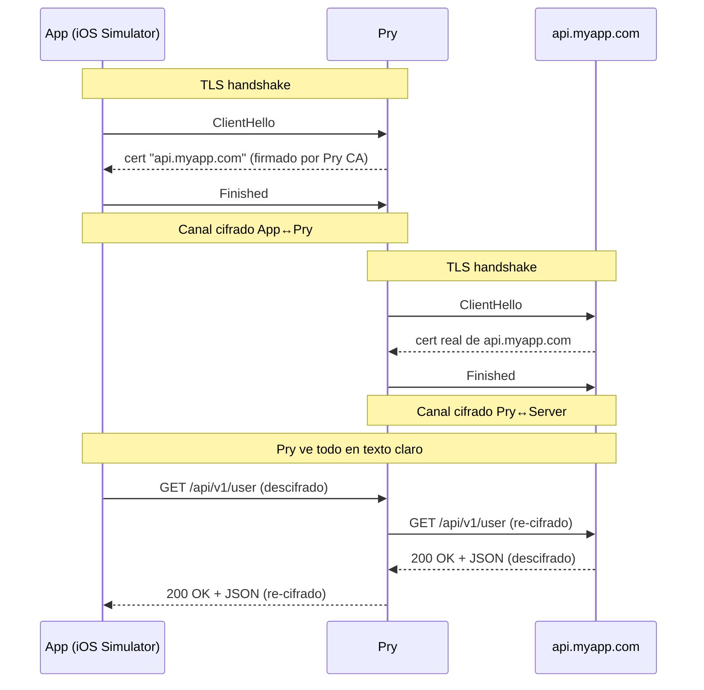
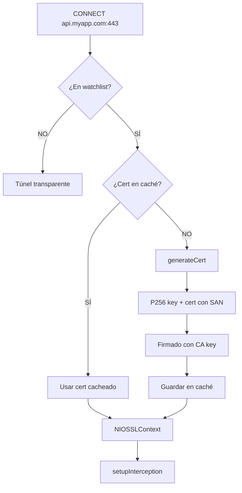
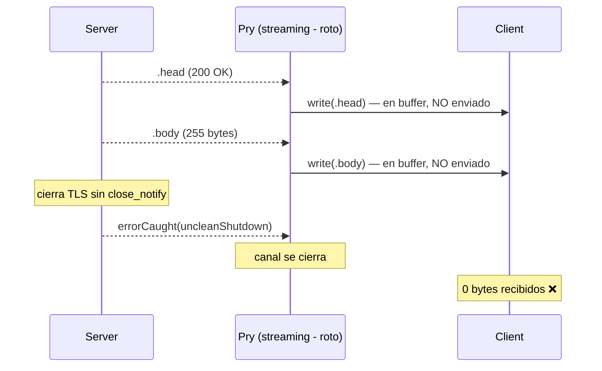
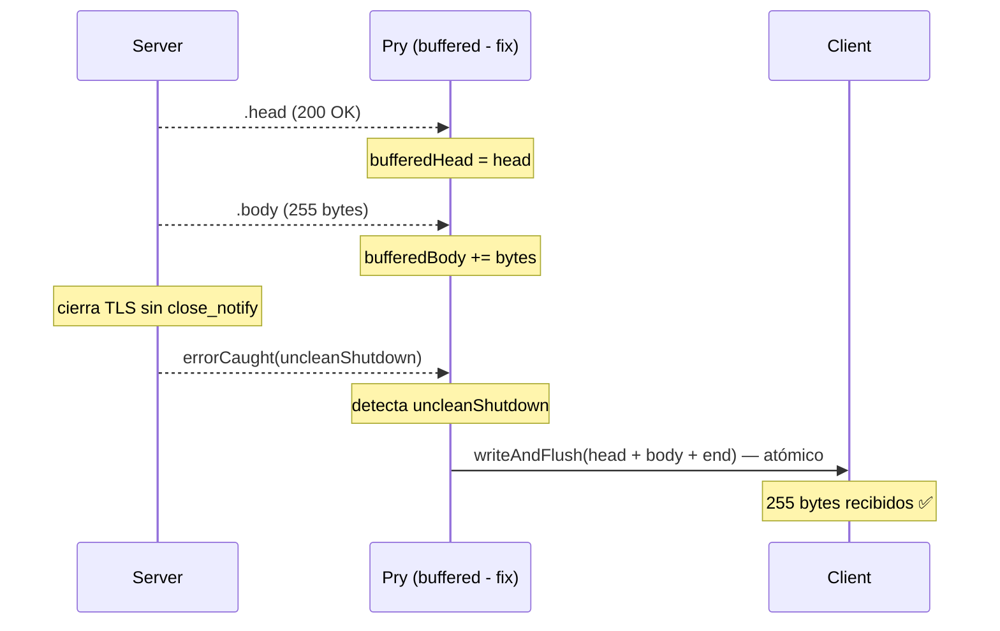

# Capítulo 4 — TLS interception

## El problema que TLS le crea a un proxy

En el capítulo anterior vimos que el túnel transparente es elegante: el proxy mueve bytes de un lado al otro sin entenderlos. El cliente hace el TLS handshake directamente con el servidor, el certificado es el real, todo está bien.

El problema es que eso no nos sirve si queremos interceptar. Los bytes que viajan por el túnel están cifrados con una clave que solo conocen el cliente y el servidor. El proxy está en el medio pero es ciego.

Para leer el tráfico, necesitamos romper esa cadena de confianza de forma controlada. El cliente hace TLS con nosotros, y nosotros hacemos TLS con el servidor real. Somos el intermediario que lo ve todo. Eso es MITM: Man-in-the-Middle.

## Qué significa ser MITM

El término tiene connotaciones maliciosas porque en seguridad es un ataque. En nuestro caso es diferente: el desarrollador es el dueño de la app, del dispositivo, y del proxy. No hay nadie engañado.

La mecánica es idéntica. El cliente cree que habla con `api.myapp.com`. El servidor cree que habla con un cliente normal. En el medio, Pry ve todo en texto claro.



Son dos conexiones TLS independientes. El cliente nunca se conecta directamente al servidor.

## La CA de Pry

Para que el cliente confíe en nuestros certificados, necesitamos una autoridad certificadora (CA) propia. La primera vez que arranca `pry start`, si no existe `~/.pry/ca/`, el proxy genera un par de claves y crea su CA:

```swift
let key = P256.Signing.PrivateKey()
let name = try DistinguishedName {
    CommonName("Pry CA")
    OrganizationName("Pry Proxy")
}

let extensions = try Certificate.Extensions {
    Critical(BasicConstraints.isCertificateAuthority(maxPathLength: 0))
    Critical(KeyUsage(keyCertSign: true, cRLSign: true))
}
```

Usamos P256 — curva elíptica de 256 bits. Más rápido que RSA-2048, más pequeño en bytes. ECDSA con SHA-256 es el algoritmo de firma.

`BasicConstraints.isCertificateAuthority` con `maxPathLength: 0` dice "soy una CA raíz, no puedo crear sub-CAs". `KeyUsage` limita las operaciones: firmar otros certs y CRLs, nada más.

El certificado se guarda en `~/.pry/ca/pry-ca.pem` y la clave privada en `~/.pry/ca/pry-ca-key.pem`.

## Generación de certificados por dominio

Cuando llega un CONNECT a `api.myapp.com:443` y el dominio está en la watchlist, Pry genera un certificado para hacerse pasar por ese servidor:

```swift
func generateCert(for domain: String) throws -> (certificate: NIOSSLCertificate, key: NIOSSLPrivateKey) {
    if let cached = certCache[domain] {
        return cached
    }

    let serverKey = P256.Signing.PrivateKey()
    let extensions = try Certificate.Extensions {
        SubjectAlternativeNames([.dnsName(domain)])
    }

    let cert = try Certificate(
        ...
        issuer: caCertificate.subject,   // firmado por nuestra CA
        issuerPrivateKey: .init(caKey)    // con la clave de nuestra CA
    )
    ...
}
```

La extensión `SubjectAlternativeNames` (SAN) es obligatoria. Todos los navegadores modernos y el stack TLS de iOS la requieren. Si solo pones el dominio en el Common Name sin SAN, la validación falla con un error críptico.

El cert se cachea en memoria. Si la misma app hace diez requests a `api.myapp.com`, Pry genera el certificado solo la primera vez.



## El doble pipeline TLS

Cuando decidimos interceptar, el pipeline del cliente se transforma completamente. El `NIOSSLServerHandler` se inserta al frente, y después se re-agregan los decoders HTTP para el tráfico descifrado:

```swift
context.pipeline.addHandler(sslHandler, position: .first).flatMap {
    context.pipeline.configureHTTPServerPipeline()
}.flatMap {
    context.pipeline.addHandler(TLSForwarder(host: host, port: port, eventLoop: context.eventLoop))
}
```

El pipeline final del canal del cliente:

```
[NIOSSLServerHandler]          ← TLS con el cliente (nuestro cert)
[HTTPRequestDecoder]
[HTTPResponseEncoder]
[TLSForwarder]                 ← lee requests, abre TLS al servidor real
```

Y por cada request, `TLSForwarder` abre un canal separado al servidor real con su propio TLS:

```
[NIOSSLClientHandler]          ← TLS con el servidor real
[HTTPClientDecoder/Encoder]
[TLSResponseForwarder]         ← escribe la respuesta de vuelta al cliente
```

## `pry trust` — instalar la CA en el Simulador

El comando `pry trust` ejecuta:

```bash
xcrun simctl keychain booted add-root-cert ~/.pry/ca/pry-ca.pem
```

Pero esto no es suficiente. iOS tiene una capa extra: los certificados raíz instalados necesitan ser explícitamente habilitados en:

```
Ajustes > General > Info > Ajustes de confianza de certificados
```

Ahí aparece "Pry CA" deshabilitado. Hay que activarlo manualmente una vez.

## Certificate pinning — la pared de ladrillo

Hay apps con las que esto nunca va a funcionar. Bancos, apps de pago, algunas apps corporativas. Usan certificate pinning: tienen hardcodeada la clave pública del certificado real del servidor. Si el certificado no coincide exactamente — aunque sea válido, aunque esté firmado por una CA de confianza — la conexión se rechaza.

No hay manera de interceptar apps con pinning sin modificar el binario. Y eso está fuera del alcance de una herramienta de desarrollo legítima.

Para el caso de uso real — debuggear tu propia API — el pinning casi nunca está activado en el build de desarrollo. Solo aparece en release o en apps de terceros. La solución es excluir ese dominio de la watchlist.

## El problema del formato PEM

PEM requiere que las líneas de Base64 tengan exactamente 64 caracteres. No 76 (que es lo que hace `Data.base64EncodedString()` por defecto en Foundation). La diferencia son 12 caracteres por línea. El error que produce son conexiones TLS que fallan silenciosamente.

```swift
// Esto genera líneas de 76 caracteres — NIOSSL lo rechaza
let base64 = Data(derBytes).base64EncodedString(options: .lineLength76Characters)

// Esto genera líneas de 64 caracteres — correcto
var lines = [String]()
var idx = base64.startIndex
while idx < base64.endIndex {
    let end = base64.index(idx, offsetBy: 64, limitedBy: base64.endIndex) ?? base64.endIndex
    lines.append(String(base64[idx..<end]))
    idx = end
}
```

Tardamos en entender que el problema no estaba en la cadena de confianza, ni en las extensiones, ni en el algoritmo de firma — estaba en el largo de las líneas del archivo de texto. A veces el bug más oscuro es un número: 76 cuando debería ser 64.

## El uncleanShutdown

Todo funcionaba en el happy path. El proxy interceptaba, descifraba, logueaba el body completo en la TUI. Pero curl decía otra cosa:

```
curl: (18) transfer closed with 255 bytes remaining to read
```

El proxy veía el body. El cliente no recibía nada. Un fantasma.

### La causa: write sin flush

SwiftNIO no envía bytes cuando llamas `write()`. Los acumula en un buffer interno. Solo salen de verdad cuando llamas `flush()` o `writeAndFlush()`. Nuestro `TLSResponseForwarder` hacía esto:

```swift
// Esto NO envía nada todavía
clientContext.write(wrapOutboundOut(.head(head)))
clientContext.write(wrapOutboundOut(.body(body)))
// Solo esto fuerza el envío
clientContext.writeAndFlush(wrapOutboundOut(.end(nil)))
```

El plan era razonable: escribir head, body, y flushear todo junto en `.end`. Pero muchos servidores — httpbin.org entre ellos — cierran la conexión TLS sin enviar el `close_notify` de TLS. SwiftNIO lo reporta como `uncleanShutdown`. El `errorCaught` se disparaba antes de que llegara el `.end`, el canal se cerraba, y los bytes de head y body se quedaban en el buffer de NIO. Nunca salieron.

### Lo que intentamos

Primer intento: agregar `Connection: close` al response para que el cliente supiera que el servidor iba a cerrar. No funcionó — URLSession en iOS ignora ese header cuando le conviene.

Segundo intento: cerrar solo el canal hacia el servidor remoto, no el del cliente. La idea era que el cliente pudiera seguir leyendo. El resultado fue peor — el canal del cliente se quedaba abierto indefinidamente, el proxy acumulaba canales zombis, y después de unas decenas de requests se saturaba.

### El fix: bufferear todo

La solución fue la misma que usa mitmproxy: no enviar nada al cliente hasta tener la response completa. Acumular head y body en memoria, y cuando llega el `.end` — o cuando llega el `uncleanShutdown` — enviar todo de un golpe con `writeAndFlush`.



Con el fix:



El `writeAndFlush` es atómico desde la perspectiva del canal — todos los bytes se entregan antes de que NIO procese el cierre. No importa que el servidor haya sido maleducado con el TLS. El cliente recibe su response completa.

### Por qué pasa el uncleanShutdown

El `close_notify` es parte del protocolo TLS. Antes de cerrar, ambos lados deberían enviar un alert de tipo `close_notify` para decir "terminé, cierro limpio". En la práctica, muchos servidores no lo hacen. Cierran el socket TCP directamente. Es más rápido, ahorra un round-trip, y los navegadores lo toleran sin problema.

SwiftNIO es más estricto. Cuando no recibe el `close_notify`, genera un `NIOSSLError.uncleanShutdown`. Si tu handler trata eso como un error fatal y cierra el canal sin flushear, pierdes los bytes. La lección es que en TLS interception, el `uncleanShutdown` no es un error — es una condición normal que hay que manejar.

## Qué aprendimos

TLS interception no es complicado en concepto pero tiene muchos detalles que hay que acertar todos a la vez. El certificado tiene que tener SAN. El PEM tiene que tener líneas de 64 caracteres. El CA tiene que estar instalado y habilitado. El pipeline de NIO tiene que transformarse en el orden correcto.

El `uncleanShutdown` es el detalle que no aparece en ningún tutorial. Todo funciona perfecto en tests locales donde el servidor cierra limpio. En producción, contra servidores reales, la mitad cierra sin `close_notify`. Si no buffereas la response, pierdes bytes silenciosamente. No hay error visible — solo un cliente que recibe 0 bytes y un proxy que jura que todo está bien.

El certificate pinning es un límite duro. No hay workaround honesto. La decisión correcta es documentarlo, excluir esos dominios, y seguir adelante.

---

**Siguiente: [Capítulo 5 — Alternativas](05-alternativas.md)**
