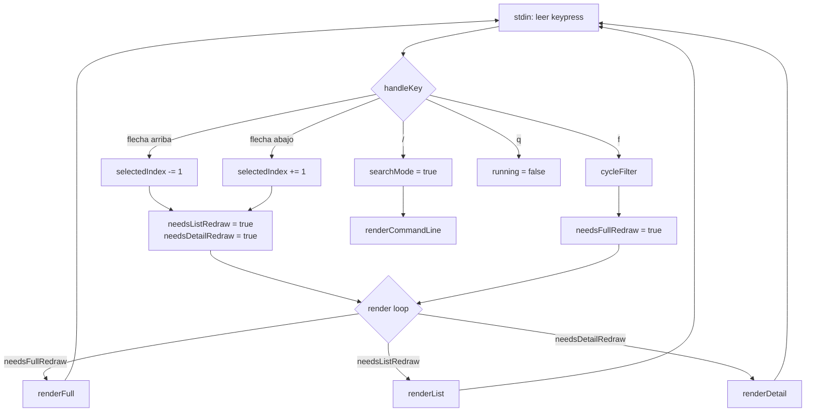
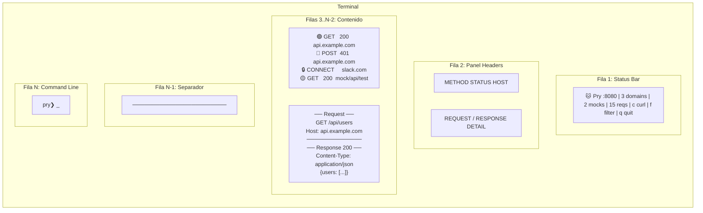
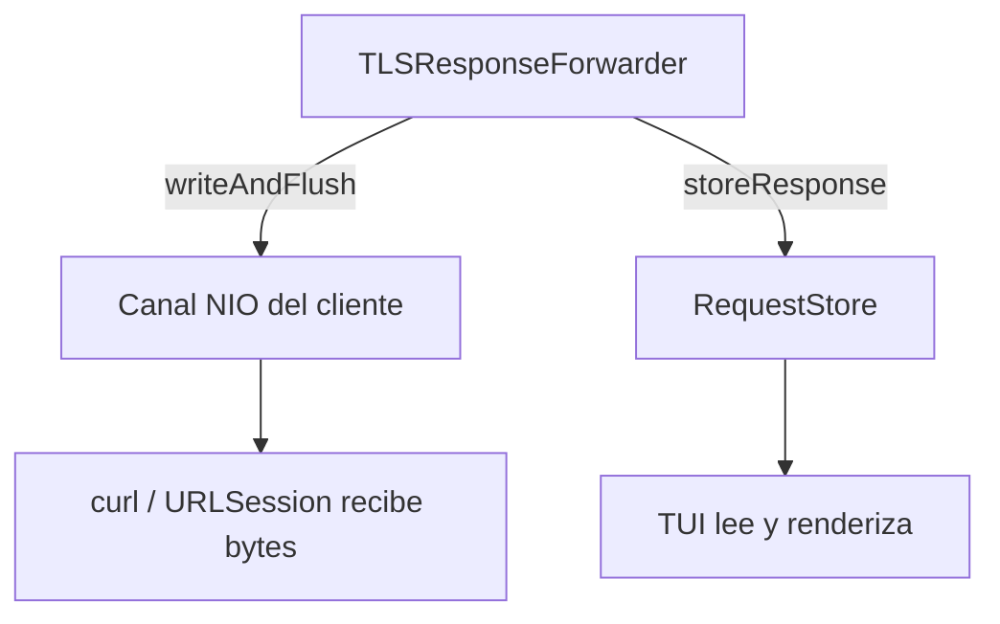

# Capitulo 8 --- La TUI: tres paneles en la terminal

## El problema de stdout

Durante semanas, Pry volcaba todo a stdout. Cada request, cada response, cada tunnel --- una cascada de texto con colores ANSI que se sentia profesional hasta que tenias mas de diez requests en pantalla.

```
→ GET /api/users 200 (45ms)
→ GET /api/config 200 (12ms)
→ POST /api/login 401 (89ms)
→ CONNECT slack.com:443 tunnel
→ GET /api/users/42 404 (23ms)
→ GET /static/bundle.js 200 (340ms)
...
```

No puedes scrollear. No puedes seleccionar un request para ver sus headers. No puedes filtrar solo los 4xx. No puedes copiar el curl de un request especifico. Solo puedes mirar como pasan las lineas, buscar con los ojos, y copiar a mano.

Para un proxy de desarrollo, eso es inaceptable. Necesitabamos una TUI.

## Por que sin dependencias

Existian opciones. ncurses lleva decadas resolviendo esto. Hay frameworks en Swift para TUI. Pero Pry tiene una regla: cero dependencias externas mas alla de SwiftNIO. Cada dependencia es un punto de falla, una actualizacion que puede romper algo, un README que puede dejar de mantenerse.

Asi que decidimos construir la TUI desde cero, con ANSI escape sequences y `termios`. Si funciono para `vim` en 1976, funciona para nosotros.

## Modelo mental: como funciona una TUI

Una terminal no es una pantalla. Es un stream de texto. Cuando escribes `print("hola")`, esos bytes van a stdout y la terminal los renderiza donde esta el cursor. No hay concepto de "ventana", "panel" o "layout". Solo texto y un cursor.

Para simular una interfaz grafica necesitas tres cosas:

**1. Raw mode**: Por defecto, la terminal espera a que el usuario presione Enter para enviar input (canonical mode). Nosotros necesitamos leer cada tecla individualmente --- flechas, Tab, Ctrl+C. Eso requiere desactivar el modo canonico via `termios`.

**2. ANSI escape sequences**: Secuencias especiales que la terminal interpreta como comandos: mover el cursor a la fila 5 columna 20, cambiar el color de fondo, limpiar una linea. Con esto podemos "pintar" en cualquier posicion de la pantalla.

**3. Event loop**: Un ciclo que lee keypresses de stdin, decide que cambio, y redibuja solo lo necesario.



## El layout de tres paneles

La pantalla se divide en regiones fijas. No hay nada dinamico ni flotante --- solo geometria calculada a partir del tamano de la terminal.



El panel izquierdo ocupa el 35% del ancho (minimo 30 columnas). El panel derecho ocupa el resto. Un separador vertical `│` los divide. La geometria se recalcula si la terminal cambia de tamano.

## Implementacion

### Terminal.swift: raw mode con termios

El archivo mas critico y el mas corto. `enableRawMode()` guarda el estado original de la terminal con `tcgetattr`, modifica los flags para desactivar echo, modo canonico, y procesamiento de senales, y aplica con `tcsetattr`. `disableRawMode()` restaura el estado original.

```swift
func enableRawMode() {
    tcgetattr(STDIN_FILENO, &originalTermios)
    var raw = originalTermios
    raw.c_iflag &= ~UInt(BRKINT | ICRNL | INPCK | ISTRIP | IXON)
    raw.c_oflag &= ~UInt(OPOST)
    raw.c_lflag &= ~UInt(ECHO | ICANON | IEXTEN | ISIG)
    raw.c_cc.16 = 0  // VMIN: return after 0 bytes
    raw.c_cc.17 = 1  // VTIME: timeout 100ms
    tcsetattr(STDIN_FILENO, TCSAFLUSH, &raw)
}
```

`VMIN = 0` y `VTIME = 1` hacen que `read()` retorne despues de 100ms si no hay input. Eso le da al run loop la oportunidad de procesar store changes y redibujar sin bloquear esperando input.

`readKey()` lee un byte de stdin y lo convierte en un `KeyEvent` enum. Las flechas llegan como secuencias de escape (`ESC [ A` para arriba), asi que hay que leer bytes adicionales cuando el primer byte es 27 (ESC).

### ANSI.swift: el lenguaje de la terminal

Un enum con constantes estaticas. Nada de logica --- solo strings. Mover el cursor a fila 5, columna 20: `"\u{001B}[5;20H"`. Fondo oscuro: `"\u{001B}[48;2;13;17;23m"`. Reset: `"\u{001B}[0m"`.

Lo importante es que todos los colores usan RGB de 24 bits (`48;2;r;g;b` para fondo, `38;2;r;g;b` para texto). No usamos los 16 colores clasicos de terminal porque no podemos controlar como se ven en cada tema. Con RGB, el color es el color.

La funcion `write()` escribe directo a `STDOUT_FILENO` sin pasar por el buffering de Swift. Esto es necesario porque `print()` bufferiza, y en una TUI necesitas que cada frame se envie completo de una vez.

### TUI.swift: 773 lineas de estado mutable

El archivo mas largo del proyecto. Tiene estado para navegacion (`selectedIndex`, `listScrollOffset`), para filtros (`activeFilter`, `searchQuery`, `isSearchMode`), para layout (`rows`, `cols`, dirty flags), y para el command buffer.

El run loop es un `while running` que hace tres cosas:

1. Checa si cambio el tamano de la terminal
2. Lee un keypress (non-blocking gracias a VTIME)
3. Redibuja solo lo que cambio

El render construye strings completas en memoria --- una variable `buf` donde concatenamos todas las secuencias ANSI --- y las escribe en una sola llamada a `ANSI.write()`. Eso evita flickering porque la terminal recibe el frame completo de golpe.

### RequestStore.swift: el store de requests

Un singleton con un array protegido por `DispatchQueue`. Cada request capturado se guarda con su id, headers, body, status code. Las responses se actualizan despues via `updateResponse(id:)`.

El patron clave es el callback `onChange`: cada vez que el store cambia, la TUI recibe una notificacion y marca sus dirty flags. No hay polling --- el store empuja los cambios.

### OutputBroker.swift: el switch de modos

En modo headless (`--headless`), los handlers del proxy llaman a `OutputBroker.log()` y el texto va directo a stdout con `print()`. En modo TUI, el broker guarda las entradas y la TUI lee del `RequestStore` directamente. El broker sigue logueando a archivo en ambos modos.

El cambio de modo es una linea: `broker.setTUIMode { ... }` o `broker.setHeadlessMode()`. Los handlers del proxy no saben ni les importa si hay TUI o no.

## Lo que fallo

### Flickering: la primera version era inutilizable

La primera iteracion redibujaba toda la pantalla en cada keypress. Mover la seleccion una fila: renderizar las 24+ filas del panel izquierdo, las 24+ filas del panel derecho, el status bar, el command line. Aproximadamente 2000 caracteres de secuencias ANSI por keypress.

El resultado era un flickering visible --- la pantalla parpadeaba cada vez que movias la seleccion. En terminales lentas (SSH, tmux con latencia) era inutilizable.

La solucion fueron tres dirty flags:

- `needsListRedraw`: solo el panel izquierdo
- `needsDetailRedraw`: solo el panel derecho
- `needsFullRedraw`: todo (resize, cambio de filtro)

Mover la seleccion activa `needsListRedraw` y `needsDetailRedraw`. Presionar una tecla de filtro activa `needsFullRedraw`. Si nada cambio, el loop no escribe nada a stdout. Eso elimino el flickering por completo.

### Raw mode sobrevive al crash

Cuando activas raw mode y el proceso muere sin restaurar la terminal, el usuario queda con una terminal rota: no ve lo que escribe, Enter no funciona como espera, Ctrl+C no hace nada visible. Hay que correr `reset` manualmente para recuperarla.

Nuestro `deinit` en `Terminal` llama a `disableRawMode()`, pero `deinit` no se ejecuta en un `kill -9` o un crash. La solucion parcial son los signal handlers en `main.swift`:

```swift
signal(SIGINT) { _ in
    // cleanup: restore terminal, remove PID file
    exit(0)
}
signal(SIGTERM) { _ in
    // cleanup
    exit(0)
}
```

Parcial porque `SIGKILL` no se puede interceptar. Si alguien hace `kill -9` al proceso, la terminal queda rota. No hay solucion para eso --- es una limitacion del modelo de senales de Unix.

### Las secuencias de escape y Unicode

Los emojis rompen el calculo de ancho. Un emoji como `🟢` ocupa dos columnas en la terminal pero Swift lo cuenta como un `Character`. El padding con `padding(toLength:)` calcula mal y las columnas se desalinean.

No resolvimos esto perfectamente. Usamos emojis de ancho conocido y ajustamos el padding manualmente. Es feo, pero funciona para el conjunto fijo de iconos que usamos.

## Que aprendimos

**Raw mode es fragil.** Siempre restaurar en cleanup. Siempre tener signal handlers. Documentar que `kill -9` rompe la terminal y que `reset` la arregla.

**Dirty flags son esenciales.** Sin ellos, cualquier TUI basada en ANSI escape sequences va a flickear. La regla es simple: no redibujar lo que no cambio.

**ANSI escape sequences son portables, pero no universales.** Los colores RGB de 24 bits funcionan en la mayoria de terminales modernas (Terminal.app, iTerm2, Alacritty, Windows Terminal). En terminales viejas o configuraciones exoticas, los colores pueden verse mal. Decidimos no soportar esas terminales.

**773 lineas de TUI.swift es manejable, pero estamos en el limite.** El archivo tiene rendering, input handling, acciones, filtros, busqueda y layout. Si agregamos una feature mas, deberiamos extraer el rendering a su propio archivo. Por ahora funciona porque todo el estado esta en un solo lugar y el flujo es lineal: keypress, accion, dirty flag, render.

**Un write() atomico evita flickering.** Construir el frame completo en un string y escribirlo de una vez a stdout es la diferencia entre una TUI que se siente solida y una que parpadea.

## Los dos flujos de datos

Pry tiene dos caminos para los datos de una response HTTPS interceptada. El primero es el canal NIO: los bytes van del servidor remoto, pasan por `TLSResponseForwarder`, y se escriben de vuelta al canal del cliente. El segundo es el `RequestStore`: la TUI lee de ahi para mostrar requests y responses en los paneles.

Son flujos independientes. El canal NIO mueve bytes. El `RequestStore` guarda metadatos. Ambos necesitan ser alimentados.



El bug del "Waiting..." aparecio cuando el primer flujo funcionaba perfecto pero el segundo no existia. `TLSResponseForwarder` reenviaba la response al cliente --- curl recibia el JSON completo --- pero nunca llamaba `storeResponse()` porque no tenia el `requestId`. Sin `requestId`, no habia forma de asociar la response con el request en el store. La TUI seguia mostrando "Waiting..." porque desde su perspectiva, la response nunca llego.

El fix fue pasar `requestId` desde `handleDecryptedRequest()` hasta `TLSResponseForwarder`. Cuando `sendBufferedResponse()` envia los bytes al cliente, tambien llama `RequestStore.shared.storeResponse(id: requestId, ...)`. Ahora ambos flujos se alimentan desde el mismo punto.

Lo interesante es que este bug no se manifesto en HTTP. Los requests HTTP pasan por `HTTPInterceptor`, que ya tenia la logica de `storeResponse()` desde el principio. Solo las responses HTTPS interceptadas usaban `TLSResponseForwarder` --- un handler distinto, escrito despues, que nadie penso en conectar al store.

Es el tipo de bug que solo aparece cuando tienes dos subsistemas que evolucionan por separado. Cada uno funciona perfecto en aislamiento. El problema es el cable que falta entre ellos.

---

Siguiente: [Features que nadie pidio](09-features-avanzadas.md)
