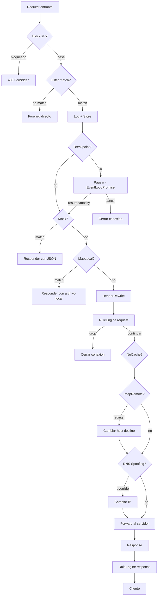
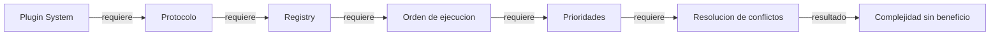

# Capitulo 9 -- Features que nadie pidio (pero todos necesitan)

## El proxy que solo intercepta

Empezamos Pry con una idea simple: ver el trafico. Interceptar, loguear, seguir adelante. Eso funciono las primeras dos semanas. Despues llego la primera peticion real: "necesito mockear este endpoint porque el backend no esta listo". Despues la segunda: "necesito pausar este request para ver que estoy mandando". Despues la tercera: "necesito redirigir produccion a staging".

Cada feature parecia pequeno. Cinco lineas aqui, diez alla. Pero el pipeline crece. Un request ya no es "recibir y reenviar" -- es una secuencia de decisiones donde cada paso puede terminar el flujo, modificar los datos, o delegar a otro sistema. Lo que empezo como un `handleRequest` de 20 lineas hoy es una cadena de 12 checks.

El error que cometimos fue no dibujar el pipeline primero. Fuimos agregando features al handler como parches. Cuando llegamos al septimo check, el orden importaba y no lo habiamos documentado. Un mock que deberia haberse aplicado antes de un header rewrite se estaba ejecutando despues. Tuvimos que parar y repensar.

---

## El pipeline completo

Este es el recorrido de un request a traves de todas las features de Pry. Cada nodo es un punto de decision. Si el request sale del flujo en cualquier nodo, los nodos siguientes nunca lo ven.



El orden no es arbitrario. BlockList va primero porque no tiene sentido loguear un request que vamos a bloquear. Filter va antes que Log porque si el dominio no nos interesa, no queremos llenar el store. Breakpoint va antes de Mock porque si el desarrollador quiere pausar un request que tambien tiene mock, la pausa gana -- el mock se aplica despues del resume.

Nos tomo tres iteraciones llegar a este orden.

---

## Las features, una por una

### Mocks -- de lo simple a lo util

La primera version de mocks era embarazosamente simple. Un diccionario path-to-JSON en un archivo plano:

```bash
pry mock /api/login '{"token":"abc123"}'
```

`Config.saveMock` escribe en `/tmp/pry.mocks`. `findMock` busca por prefijo. Cuando llega un request a `/api/login`, el proxy responde con el JSON sin tocar la red. Funciono de inmediato.

El primer problema llego con dominios. Si mockeas `/api/users`, cualquier dominio que haga GET a `/api/users` recibe el mock. Eso no sirve cuando interceptas tres APIs distintas. Agregamos domain-scoped mocks con la sintaxis `domain.com:/path`:

```swift
if mockKey.contains(":") {
    let parts = mockKey.split(separator: ":", maxSplits: 1)
    let mockDomain = String(parts[0])
    let mockPath = String(parts[1])
    if host.contains(mockDomain) && path.hasPrefix(mockPath) {
        return response
    }
}
```

El segundo descubrimiento fue accidental. Un usuario hizo `pry mock api.example.com/users '[]'` sin haber agregado el dominio a la watchlist. El mock nunca se aplico porque el trafico HTTPS pasaba como tunel transparente -- el proxy nunca veia el path. La solucion obvia: auto-add a la watchlist cuando el mock tiene dominio.

```bash
# Esto ahora hace dos cosas:
pry mock api.example.com/users '{"users":[]}'
# 1. Agrega api.example.com a la watchlist
# 2. Registra el mock domain-scoped
```

Tres lineas de codigo. Elimino una categoria entera de errores de usuario.

### Breakpoints -- pausar sin bloquear

Este fue el feature mas interesante tecnicamente. La idea: cuando un request matchea un patron, el proxy lo pausa. El desarrollador lo inspecciona en la TUI, decide si continuar, modificar, o cancelar.

El problema es que SwiftNIO es event-loop driven. No puedes hacer `Thread.sleep` en un handler -- bloqueas el event loop entero y el proxy se congela. Necesitabamos una forma de "pausar" un request sin bloquear nada.

La solucion: `EventLoopPromise`. Creamos una promesa en el event loop del canal, guardamos el request pausado en memoria, y retornamos el future. El handler no avanza hasta que la promesa se resuelve. Pero el event loop sigue procesando otros requests normalmente.

```swift
func pause(id: Int, head: HTTPRequestHead, body: ByteBuffer?,
           host: String, eventLoop: EventLoop) -> EventLoopFuture<BreakpointAction> {
    let promise = eventLoop.makePromise(of: BreakpointAction.self)
    let paused = PausedRequest(
        id: id, method: "\(head.method)", url: head.uri,
        host: host, headers: head.headers.map { ($0.name, $0.value) },
        body: bodyStr, timestamp: Date(), promise: promise
    )
    pausedRequests.append(paused)
    return promise.futureResult
}
```

Cuando el usuario presiona `b` en la TUI, `resume(id:action:)` busca el request pausado y completa la promesa:

```swift
public func resume(id: Int, action: BreakpointAction) {
    if let idx = pausedRequests.firstIndex(where: { $0.id == id }) {
        let paused = pausedRequests.remove(at: idx)
        paused.promise.succeed(action)
    }
}
```

La promesa se resuelve, el future avanza, y el handler continua con `.resume`, `.modify`, o `.cancel`. Cero bloqueo, cero threads extra.

El error que cometimos al principio fue usar `DispatchSemaphore` en lugar de `EventLoopPromise`. Funcionaba en tests, congelaba el proxy en produccion. La leccion: en NIO, todo es futures y promesas. Si usas primitivas de concurrencia de Grand Central Dispatch dentro de un handler, vas a tener problemas.

### Block List -- simple y suficiente

Algunas veces no quieres interceptar un dominio. Quieres bloquearlo. Trackers, analytics, dominios que contaminan el log.

```bash
pry block "*.tracker.com"
```

Un archivo plano con un patron por linea. Wildcards con matching de sufijo. Responde con 403 y un JSON minimo. Va al principio del pipeline porque no tiene sentido procesar un request que vamos a bloquear.

### Header Rewrite -- inyectar y eliminar

Agregar o quitar headers en todos los requests. El caso de uso mas comun: inyectar tokens de autenticacion.

```bash
pry header add Authorization "Bearer eyJhb..."
pry header remove X-Debug-Token
```

Las reglas se almacenan como TSV (tab-separated) en `/tmp/pry.headers`. Add agrega al final, remove elimina por nombre case-insensitive. Consideramos YAML o JSON. Decidimos que TSV con dos campos es suficiente. Un header tiene nombre y valor. Un tab los separa.

### Map Local -- archivos locales como responses

Sirve un archivo local cuando la URL matchea un regex. Util para trabajar con respuestas grandes que no caben en un argumento de linea de comandos.

```bash
pry map "/api/v2/products.*" /tmp/products.json
```

La implementacion lee el archivo al momento del match, no al registro. Eso permite editar el archivo y que el proximo request use la version actualizada sin reiniciar nada.

```swift
public static func matchContent(url: String) -> String? {
    guard let filePath = match(url: url) else { return nil }
    return try? String(contentsOfFile: filePath, encoding: .utf8)
}
```

El error inicial fue cachear el contenido del archivo. Parecia mas eficiente. Pero el caso de uso real es iterar: editar el JSON, hacer el request, ver que falta, editar de nuevo. El cache mataba ese flujo.

### Map Remote -- redirigir hosts

Cambia el host de destino sin tocar el header Host. Produccion a staging. Staging a local.

```bash
pry redirect api.production.com api.staging.com
```

El request llega con `Host: api.production.com`. El proxy conecta a `api.staging.com`. El servidor de staging recibe el header Host original -- necesario para que virtual hosts funcionen.

```swift
var connectHost = host
if let remapped = MapRemote.match(host: host) {
    connectHost = remapped
}
// Forward usa connectHost para TCP, host para el header
```

La distincion entre "a donde conecto" y "que Host header mando" es crucial. Confundirlos fue nuestro primer bug: el redirect funcionaba pero el servidor respondia con 404 porque no reconocia el Host.

### DNS Spoofing -- override de resolucion

Override de DNS por dominio. Apunta un dominio a una IP especifica.

```bash
pry dns api.myapp.com 192.168.1.100
```

Tiene tres puntos de insercion en el codigo. Para HTTP plano, se aplica en `HTTPInterceptor.handleRequest` justo antes del forward. Para HTTPS en modo tunel (no interceptado), se aplica en `ConnectHandler` al establecer la conexion TCP. Para HTTPS interceptado, se aplica en el forwarder que conecta al servidor real.

El tercer caso fue el que olvidamos. Los primeros dos funcionaban. Pero cuando un dominio estaba en la watchlist (HTTPS interceptado), el DNS spoofing no se aplicaba porque la conexion al servidor real se hacia desde un handler diferente. Tuvimos que agregar el check en tres lugares distintos.

### Save/Load Sessions -- Codable y sus limites

Quisimos poder guardar una sesion de captura y restaurarla despues. `pry save session.pry` y `pry load session.pry`. La idea era simple: serializar el array de `CapturedRequest` a JSON.

El problema: `CapturedRequest` tiene headers como `[(String, String)]` -- tuplas. Las tuplas no conforman `Codable` en Swift. El compilador no genera la implementacion automatica.

La solucion fue un wrapper:

```swift
private struct CodableHeader: Codable {
    let name: String
    let value: String
}

// En encode:
try c.encode(requestHeaders.map {
    CodableHeader(name: $0.0, value: $0.1)
}, forKey: .requestHeaders)

// En decode:
requestHeaders = try c.decode([CodableHeader].self,
    forKey: .requestHeaders).map { ($0.name, $0.value) }
```

No es elegante. Agregamos un struct que existe solo para hacer un round-trip de serializacion. Pero funciona, y la alternativa -- cambiar la representacion interna de headers en todo el proyecto -- era peor.

### HAR Export -- el formato universal

HAR (HTTP Archive) es el formato estandar para intercambio de trafico HTTP. Charles lo exporta, Chrome DevTools lo exporta. Pry lo exporta.

```bash
pry har export session.har
```

El `HARExporter` recorre el `RequestStore`, convierte cada `CapturedRequest` a la estructura HAR (JSON con campos estandarizados), y escribe el archivo. Compatible con cualquier herramienta que lea HAR.

La implementacion usa `JSONSerialization` con diccionarios `[String: Any]` en lugar de structs Codable. Fue una decision pragmatica: el formato HAR tiene campos opcionales anidados tres niveles de profundidad. Modelar eso con structs Codable habria sido mas codigo del que vale.

### Copy as cURL/Swift/Python

`CurlGenerator` ya existia desde el principio. Agregar `SwiftGenerator` y `PythonGenerator` fue seguir el mismo patron: cada generador toma un `CapturedRequest` y produce un string. El unico detalle interesante es el escape de strings -- cada lenguaje tiene sus propias reglas para caracteres especiales dentro de literales.

### Diff Tool -- comparar requests

Seleccionar dos requests y ver las diferencias. Verde para agregado, rojo para eliminado.

```bash
pry diff 15 23
```

Compara campo por campo: method, URL, host, headers, body, status, response body. Los headers se convierten a diccionarios para hacer set difference. El caso de uso: "hice el mismo request dos veces y uno fallo. Que cambio?" Antes habia que comparar visualmente. Ahora son las diferencias y nada mas.

---

## La decision clave: por que no plugins

Cuando el pipeline llego a 12 features, la pregunta obvia fue: deberiamos tener un sistema de plugins? Un protocolo `PryPlugin` con `func shouldHandle(request:)` y `func handle(request:)`. Cada feature como un plugin separado.

Lo consideramos. Lo disenamos. Lo descartamos.

Cada feature es 5-15 lineas en el handler. No hay logica compartida compleja entre ellos. El orden importa y esta hardcodeado intencionalmente -- no queremos que un plugin se inserte en el lugar equivocado.



Un sistema de plugins tiene sentido cuando hay contribuidores externos que quieren extender la herramienta sin modificar el core. Pry no tiene ese problema. Si alguien quiere un feature nuevo, agrega un `if` en el handler. Es mas facil de entender, mas facil de debuggear, y no necesita documentacion de API.

La sofisticacion que descartamos nos habria costado mas que todas las features juntas.

---

## El Rule Engine -- casi un plugin system

Lo mas cerca que llegamos de un sistema extensible fue el `RuleEngine`. Un archivo `.pryrules` con formato declarativo:

```
rule "/api/v2/*"
  set-header X-Debug "true"
  remove-header Cookie

rule "POST /api/login"
  delay 2000
```

El parser lee el archivo, construye objetos `Rule` con `RuleAction` enums, y los aplica en dos puntos del pipeline: uno para requests, otro para responses.

Es mas flexible que los features individuales pero menos que un plugin system. No puede ejecutar codigo arbitrario. Solo puede hacer las acciones que definimos en `RuleAction`. Eso es intencional -- no queremos que un archivo de reglas pueda hacer `drop` sin que sea obvio.

---

## Que aprendimos

Los comandos simples ganan. `pry mock /path '{}'` es mas poderoso que escribir un script de Python con mitmproxy addons. No porque sea mas capaz -- es menos capaz. Pero el costo de usarlo es cero. No hay archivos de configuracion, no hay imports, no hay boilerplate.

El pipeline de un proxy es una cadena de decisiones pequenas. Cada feature es otro `if` en la cadena. La complejidad no esta en cada feature individual -- esta en el orden y en las interacciones entre ellos. Un mock que se aplica antes de un header rewrite se comporta diferente que uno que se aplica despues.

Lo que mas nos sorprendio: las features que parecian triviales (block list, header rewrite, no-cache) son las que mas se usan. Las que parecian sofisticadas (rule engine, diff tool) se usan ocasionalmente. La leccion es que la utilidad de un feature no correlaciona con su complejidad de implementacion.

Y sobre la decision de no hacer plugins: un ano despues, nadie lo ha pedido. Cada feature nuevo se agrega en menos de una hora. El handler tiene 150 lineas. Si algun dia crece a 500, reconsideraremos. Pero no antes.

---

**Siguiente: [Scripting sin scripting](10-scripting.md)**
