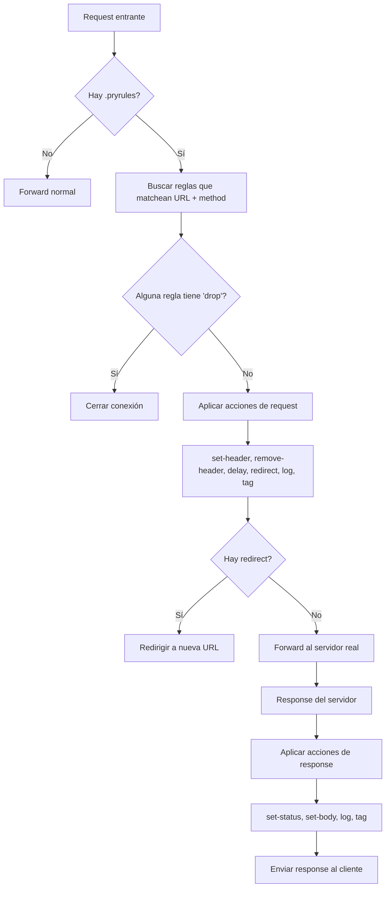

# Capitulo 10 — Scripting sin scripting

## El problema que no queríamos resolver

La pregunta llegó inevitablemente: "¿Pry tiene scripting?"

Proxyman tiene JavaScript rules. mitmproxy tiene Python addons — un sistema completo donde importas `mitmproxy.http`, defines hooks, y puedes transformar cualquier request o response con lógica arbitraria. Charles tiene rewrite rules con una UI de ventanas modales. Cada herramienta decidió que el usuario necesita un lenguaje de programación para manipular tráfico.

Y tienen razón. Hay escenarios donde necesitas lógica condicional, variables, loops. Pero nos preguntamos: ¿cuántos devs iOS realmente escriben scripts de proxy? En nuestra experiencia, el 80% de los casos son siempre los mismos:

1. Agregar un header `Authorization` a todo lo que vaya a `/api/*`
2. Remover cookies de un dominio
3. Bloquear requests a dominios de tracking
4. Mockear un endpoint con un JSON fijo
5. Simular una red lenta

Cinco patrones. Repetidos cientos de veces. Para eso no necesitas un runtime — necesitas un archivo de configuración con opiniones fuertes.

## La decisión: DSL declarativo

Evaluamos las opciones:

**JavaScriptCore**: Viene con macOS, API estable. Pero es macOS-only. En Linux no existe. Y Pry compila en ambas plataformas. Meter un runtime de JavaScript significaba partir la compatibilidad o buscar un intérprete JS para Linux — exactamente el tipo de dependencia externa que queríamos evitar.

**Process externo**: Lanzar un proceso Python/Ruby/lo que sea como hijo, comunicarse por stdin/stdout. El overhead de IPC por cada request es inaceptable. Un proxy que agrega 50ms de latencia por un pipe de proceso no es un proxy — es un obstáculo.

**WASM runtime**: Técnicamente elegante. Prácticamente overkill. Meter un runtime de WebAssembly para reescribir un header es como usar un cañón para abrir una nuez.

**DSL declarativo**: Un formato propio, sin runtime, parseado línea por línea. Cero dependencias. Cubre los cinco patrones. Lo que no cubre, lo resuelves con `pry mock` o un script externo que llame al CLI.

Elegimos el DSL.

## El formato .pryrules

La primera pregunta fue la sintaxis. JSON era la opción obvia — ya lo usamos en mocks. Pero JSON para reglas de rewrite es terrible:

```json
{
  "rules": [{
    "pattern": "/api/*",
    "actions": [
      {"type": "set-header", "name": "Authorization", "value": "Bearer token"},
      {"type": "remove-header", "name": "Cookie"}
    ]
  }]
}
```

Demasiadas llaves, demasiadas comillas, imposible de editar rápido en vim. TOML mejora la situación pero sigue siendo verboso para listas de acciones.

Nos inspiramos en lo que ya funciona: indentación como estructura, igual que Python o YAML, pero sin la complejidad de YAML. El resultado:

```
rule "/api/*"
  set-header Authorization "Bearer token"
  remove-header Cookie

rule "POST /api/auth"
  set-status 200
  set-body '{"token":"mock"}'

rule "*.tracker.com"
  drop
```

Tres reglas. Nueve líneas. Sin llaves, sin comas, sin tipos. La indentación define qué acciones pertenecen a qué regla. `rule` abre un bloque. Las líneas indentadas son acciones. Una línea vacía o un nuevo `rule` cierra el bloque anterior.

### Las nueve acciones

| Acción | Efecto | Fase |
|--------|--------|------|
| `set-header NAME VALUE` | Agrega o reemplaza header | Request |
| `remove-header NAME` | Elimina header | Request |
| `set-status CODE` | Cambia status code | Response |
| `set-body JSON` | Reemplaza body | Response |
| `drop` | Descarta la conexión | Request |
| `delay MS` | Agrega latencia artificial | Request |
| `redirect URL` | Redirige a otra URL | Request |
| `log MESSAGE` | Imprime en stdout | Ambas |
| `tag LABEL` | Agrega etiqueta visual en TUI | Ambas |

Nueve acciones. No diez, no veinte. Nueve que cubren lo que un iOS dev necesita diariamente.

## Implementación del parser

El parser es deliberadamente simple — 60 líneas de Swift. Lee el archivo línea por línea, mantiene un estado mínimo:

```swift
struct PryRule {
    let pattern: String
    let method: String?      // nil = any method
    let actions: [RuleAction]
}

func parseRules(_ content: String) -> [PryRule] {
    var rules: [PryRule] = []
    var currentPattern: String?
    var currentMethod: String?
    var currentActions: [RuleAction] = []

    for line in content.components(separatedBy: "\n") {
        let trimmed = line.trimmingCharacters(in: .whitespaces)
        if trimmed.isEmpty || trimmed.hasPrefix("#") { continue }

        if trimmed.hasPrefix("rule ") {
            // Flush previous rule
            if let pattern = currentPattern {
                rules.append(PryRule(pattern: pattern,
                                     method: currentMethod,
                                     actions: currentActions))
            }
            // Parse new rule: "rule" + optional method + pattern
            let tokens = tokenize(trimmed)
            // ... extract pattern and optional method
            currentActions = []
        } else if line.hasPrefix("  ") || line.hasPrefix("\t") {
            // Indented = action belonging to current rule
            if let action = parseAction(trimmed) {
                currentActions.append(action)
            }
        }
    }
    // Don't forget the last rule
    if let pattern = currentPattern {
        rules.append(PryRule(pattern: pattern,
                             method: currentMethod,
                             actions: currentActions))
    }
    return rules
}
```

No hay AST. No hay lexer separado. No hay manejo de errores sofisticado — si una línea no parsea, se ignora con un warning. El parser es tan simple que es casi imposible que tenga bugs. Esa es la ventaja de un DSL restringido.

### Pattern matching

Los patrones usan glob-style matching, igual que la watchlist:

- `/api/*` — cualquier path que empiece con `/api/`
- `*.tracker.com` — cualquier subdominio de tracker.com
- `POST /api/auth` — solo POST a ese path exacto
- `GET /api/users/*` — solo GET a paths bajo `/api/users/`

Convertimos el glob a regex internamente con `fnmatch`-style replacement: `*` se convierte en `.*`, el resto es literal. Simple y predecible.

## El flujo de un request a través del RuleEngine



Las reglas se evalúan en orden. Si múltiples reglas matchean, todas se aplican secuencialmente. `drop` es terminal — si cualquier regla dice `drop`, la conexión se cierra sin forward.

## Network Throttling

El `delay` en las reglas es útil para un endpoint específico. Pero a veces necesitas simular una red lenta globalmente — para todo el tráfico. Para eso implementamos throttling con presets:

```bash
pry start --throttle 3g       # ~750 kbps, 200ms latency
pry start --throttle slow      # ~256 kbps, 500ms latency
pry start --throttle edge      # ~50 kbps, 800ms latency
```

El mecanismo interno es un token bucket. La idea es simple: tienes un balde con tokens. Cada byte que pasa consume un token. Los tokens se rellenan a una tasa fija — esa tasa es el bandwidth.

```swift
struct TokenBucket {
    let bytesPerSecond: Int
    let latencyMs: Int
    var availableTokens: Int
    var lastRefill: Date

    mutating func consume(_ bytes: Int) -> TimeInterval {
        refill()
        if availableTokens >= bytes {
            availableTokens -= bytes
            return TimeInterval(latencyMs) / 1000.0
        }
        // Not enough tokens — calculate wait time
        let deficit = bytes - availableTokens
        let waitSeconds = Double(deficit) / Double(bytesPerSecond)
        availableTokens = 0
        return waitSeconds + TimeInterval(latencyMs) / 1000.0
    }
}
```

El token bucket no es perfecto — no simula jitter ni packet loss. Pero para probar cómo tu app maneja timeouts y loading states, es suficiente. Charles cobra por esta feature. Proxyman la tiene en la versión Pro. Aquí es un flag.

## GraphQL auto-detection

Esto fue un descubrimiento accidental. Mientras debuggeábamos una app que usaba GraphQL, todos los requests aparecían como `POST /graphql` en la TUI. Inútil — no puedes distinguir una query de users de una query de products si todas dicen lo mismo.

La solución: parsear el body de POST requests que van a paths que terminan en `/graphql`. Si el body tiene una key `"query"`, extraer el nombre de la operación:

```swift
func detectGraphQL(body: String?, url: String) -> String? {
    guard url.hasSuffix("/graphql"),
          let data = body?.data(using: .utf8),
          let json = try? JSONSerialization.jsonObject(with: data) as? [String: Any],
          let query = json["query"] as? String else {
        return nil
    }
    // Extract operation name: "query GetUsers" or "mutation CreateUser"
    let pattern = #"(query|mutation|subscription)\s+(\w+)"#
    if let match = query.range(of: pattern, options: .regularExpression) {
        return String(query[match])
    }
    return nil
}
```

En la TUI, en lugar de ver:

```
POST /graphql          200  1.2s
POST /graphql          200  0.8s
POST /graphql          200  2.1s
```

Ves:

```
POST /graphql  query GetUsers         200  1.2s
POST /graphql  mutation CreateUser    200  0.8s
POST /graphql  query GetProducts      200  2.1s
```

Es un detalle pequeño. Pero la diferencia entre una herramienta que usas y una que abandonas está hecha de detalles pequeños.

## Lo que NO hicimos

Mantener una lista de lo que decidimos no hacer es tan importante como documentar lo que hicimos:

- **JavaScriptCore**: macOS-only. Rompe la promesa de compilar en Linux.
- **Proceso externo para scripting**: IPC overhead por cada request. Inaceptable para un proxy.
- **WASM runtime**: Elegante en teoría. En la práctica, meter `wasmtime` como dependencia duplica el tamaño del binario.
- **Intérprete de Python embebido**: Paradoja total — el proyecto existe para no depender de Python.
- **Lenguaje Turing-completo propio**: Si alguien necesita loops y condicionales, que use un script externo que llame `pry mock`. No vamos a inventar un lenguaje.

La tentación de agregar features es constante. Cada feature que rechazamos es una feature que no tenemos que mantener, documentar, debuggear y soportar.

## Qué aprendimos

El instinto de ingeniero dice "hazlo general". Un sistema de reglas con un lenguaje de scripting real es más poderoso. Puede hacer todo lo que el DSL hace, y más.

Pero "más poderoso" no significa "mejor". Un DSL de nueve acciones se aprende en dos minutos. Un sistema de scripting con JavaScript requiere entender el modelo de hooks, el ciclo de vida del request, los objetos disponibles, la API de transformación. El poder tiene un costo: la curva de aprendizaje.

Descubrimos que para el workflow real de un iOS dev — interceptar, modificar headers, mockear responses, bloquear trackers — nueve acciones declarativas cubren el 80% de los casos. Y el 20% restante se resuelve con `pry mock` desde un script de bash.

No necesitas un lenguaje de programación dentro de tu proxy. Necesitas un archivo de texto plano que diga lo que quieres, sin ceremonias.

---

**Siguiente: [La comparativa honesta](11-comparativa.md)**
