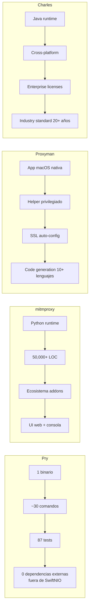

# Capitulo 11 — La comparativa honesta

## Lo que logramos

Empecemos con los números. Pry tiene ~30 comandos CLI, 87 tests, un binario universal que compila en macOS y Linux. Intercepta HTTP y HTTPS selectivamente, mockea endpoints con un comando, exporta HAR, reescribe headers, bloquea dominios, detecta GraphQL, soporta breakpoints, y tiene una TUI de tres paneles que corre en cualquier terminal.

Todo en Swift puro. Sin Python. Sin Java. Sin Electron. Sin runtime externo.

Eso suena bien en un README. Pero la pregunta real no es qué tiene Pry — es cómo se compara con las herramientas que la gente ya usa. Y la respuesta honesta es: depende de qué necesitas hacer.

## La tabla que nadie quiere publicar

Las comparativas en READMEs siempre favorecen al proyecto que las publica. La nuestra intenta no hacerlo.

### Levantar el proxy

| Herramienta | Comando / pasos |
|-------------|----------------|
| **Pry** | `pry start` |
| **mitmproxy** | `mitmproxy` o `mitmweb` |
| **Proxyman** | Abrir app (auto-start) |
| **Charles** | Abrir app, esperar splash, aceptar trial |

Aquí estamos parejos. mitmproxy y Pry son un comando. Proxyman gana en conveniencia — abres la app y ya. Charles pierde por el splash de trial que aparece cada vez.

### Mockear un endpoint

| Herramienta | Comando / pasos |
|-------------|----------------|
| **Pry** | `pry mock /api/login '{"token":"abc"}'` |
| **mitmproxy** | Escribir addon Python, guardar archivo, lanzar con `-s script.py` |
| **Proxyman** | Tools > Map Local > Browse > Select file > Configure URL pattern |
| **Charles** | Tools > Map Local > Add > Browse > Configure path + file |

Este es nuestro punto fuerte. Un comando. Sin archivos intermedios. Sin ventanas modales. Para el caso de uso de "quiero que este endpoint devuelva este JSON mientras desarrollo", no hay nada más rápido.

### Interceptar HTTPS de un dominio

| Herramienta | Comando / pasos |
|-------------|----------------|
| **Pry** | `pry add api.myapp.com && pry trust` |
| **mitmproxy** | Configurar proxy en sistema, instalar cert manualmente |
| **Proxyman** | Abrir app, instalar helper, activar auto-SSL |
| **Charles** | Configurar proxy, SSL > Enable, agregar dominio, instalar cert |

Proxyman gana aquí. Su helper de macOS automatiza todo — un click y SSL proxying funciona. Pry requiere dos comandos y un paso manual en Simulator Settings. mitmproxy y Charles requieren configuración manual del sistema.

### Filtrar trafico

| Herramienta | Expresion |
|-------------|-----------|
| **Pry** | `pry watch api.myapp.com` |
| **mitmproxy** | `~d api.myapp.com` o `~u /api/.*` |
| **Proxyman** | Barra de filtro en GUI, filtros por dominio/path/status |
| **Charles** | Sequence filter + Focus host |

mitmproxy tiene el sistema de filtros más poderoso. Expresiones como `~d domain & ~m POST & ~s 500` filtran por dominio, método y status code en una sola línea. Pry filtra por dominio. Proxyman tiene filtros visuales intuitivos. Es un área donde nos falta crecer.

### Breakpoints

| Herramienta | Comando / pasos |
|-------------|----------------|
| **Pry** | `pry break /api/login` (pausa en TUI) |
| **mitmproxy** | Intercept filter: `~u /api/login`, editar en interfaz |
| **Proxyman** | Right-click > Breakpoint, editar request/response en GUI |
| **Charles** | Proxy > Breakpoints > Add, editar en ventana modal |

Proxyman gana de nuevo. Su editor visual de breakpoints es excelente — ves el request, modificas headers o body, y continúas. Pry pausa el request en la TUI pero la edición es limitada. Es funcional, no es cómodo.

### Exportar HAR

| Herramienta | Comando / pasos |
|-------------|----------------|
| **Pry** | `pry export har traffic.har` |
| **mitmproxy** | `mitmdump -w output` (formato propio), convertir con script |
| **Proxyman** | File > Export > HAR |
| **Charles** | File > Export Session > HAR |

Todos exportan HAR excepto mitmproxy, que usa su formato nativo y requiere conversión. Un comando vs. tres clicks — diferencia marginal.

### Copy as cURL

| Herramienta | Metodo |
|-------------|--------|
| **Pry** | `c` en TUI |
| **mitmproxy** | `e` para exportar, seleccionar cURL |
| **Proxyman** | Right-click > Copy as cURL |
| **Charles** | Right-click > Copy cURL Request |

Equivalente en todos. La tecla `c` en la TUI de Pry es un poco más rápido que un right-click, pero la diferencia es trivial.

### Header rewrite

| Herramienta | Comando / pasos |
|-------------|----------------|
| **Pry** | `pry header add Authorization "Bearer token"` |
| **mitmproxy** | Script Python con `modify_headers` addon |
| **Proxyman** | Tools > Header Manipulation > Add rule |
| **Charles** | Rewrite tool > Add rule > Configure header |

Pry y Proxyman son directos. mitmproxy requiere un script — más poderoso pero más fricción. Charles tiene una UI funcional pero verbosa.

### Bloquear dominio

| Herramienta | Comando / pasos |
|-------------|----------------|
| **Pry** | `pry block *.tracker.com` |
| **mitmproxy** | `~d tracker.com` + script para rechazar |
| **Proxyman** | Tools > Block List > Add domain |
| **Charles** | Tools > Block List > Add |

Equivalente. Un comando vs. una ventana modal. Funcionalidad idéntica.

### Code generation

| Herramienta | Lenguajes |
|-------------|-----------|
| **Pry** | cURL (copy desde TUI) |
| **mitmproxy** | cURL, Python, raw |
| **Proxyman** | cURL, Swift, Python, JavaScript, Go, + más |
| **Charles** | cURL |

Proxyman gana por goleada. Generar código Swift directamente desde un request capturado es invaluable para iOS devs. Pry solo genera cURL. Es un área donde admitimos la limitación.

### Guardar sesion

| Herramienta | Metodo |
|-------------|--------|
| **Pry** | `pry export har file.har` + `pry log` |
| **mitmproxy** | `mitmdump -w session` (binario), reload con `-r` |
| **Proxyman** | File > Save (formato nativo) |
| **Charles** | File > Save Session (.chls) |

Proxyman y Charles tienen formatos nativos que preservan todo el estado. mitmproxy tiene replay. Pry exporta HAR — estándar pero sin replay nativo.

## Lo que cada uno hace mejor

No hay herramienta perfecta. Cada una tiene un nicho donde es la mejor opción:

### Proxyman

GUI nativa para macOS que se siente como una app de Apple. Inspección visual de requests con syntax highlighting, formateo automático de JSON, árbol de dominios. El helper de macOS automatiza la configuración de SSL. Drag & drop de certificados. Si eres un iOS dev visual que prefiere GUI, Proxyman es la respuesta correcta. Vale cada centavo de la licencia.

### mitmproxy

El sistema de scripting más poderoso. Addons en Python que pueden transformar cualquier aspecto del tráfico. Filtros expresivos que combinan dominio, método, status, headers, body. Reverse proxy mode para testing de APIs. Si necesitas automatización compleja o integración con pipelines de CI en Python, mitmproxy es imbatible.

### Charles

El estándar de la industria. Funciona en macOS, Windows y Linux (Java). Soporte enterprise con licencias corporativas. Throttling avanzado con perfiles de red realistas. Si tu empresa ya tiene licencias de Charles y necesitas soporte cross-platform, no hay razón para cambiar.

### Pry

Cero dependencias externas. Un binario. Mocking en un comando. Config como archivos de texto versionables en git. Open source, en Swift, que un iOS dev puede leer, entender y modificar. Si vives en la terminal, si quieres que tu configuración de proxy sea código, si te importa entender cómo funciona la herramienta que usas — Pry es para ti.

## Lo que decidimos no hacer

Mantener esta lista es un acto de disciplina:

- **SOCKS proxy**: El 99% de los iOS devs usan HTTP proxy. SOCKS es para VPNs y herramientas de seguridad. Si alguien lo necesita, que abra un issue.
- **Protobuf decoder**: Nicho dentro de un nicho. Las apps que usan Protobuf ya tienen sus propias herramientas de debugging.
- **gRPC nativo**: Requiere HTTP/2, que es un cambio fundamental en la arquitectura del proxy. SwiftNIO soporta HTTP/2, pero reescribir el pipeline es un proyecto en sí mismo.
- **UI nativa**: No porque sea mala idea — porque no es el foco. Si alguien quiere construir una UI sobre Pry, la arquitectura CLI-first lo permite. El proxy es una librería (`PryLib`). El CLI es solo un frontend.
- **Plugins de terceros**: Un sistema de plugins requiere una API estable, versionamiento semántico real, documentación de la API, y soporte para breaking changes. Es un compromiso que no estamos listos para hacer.

Cada feature que no agregamos es mantenimiento que no tenemos que hacer, documentación que no tenemos que escribir, bugs que no tenemos que arreglar. El software crece por lo que le agregas. Sobrevive por lo que decides no agregarle.

## Los numeros que importan

Los números no cuentan la historia completa. 87 tests no hacen una herramienta confiable — la confiabilidad viene de usar la herramienta todos los días y arreglar lo que falla. 30 comandos no hacen una herramienta completa — la completitud viene de que esos 30 comandos resuelvan los problemas reales.

Pero los números sí dicen algo: se puede construir un proxy HTTP/HTTPS funcional, en Swift, con una sola persona y un compilador. No se necesita un equipo de diez ingenieros ni un presupuesto de producto. Se necesita un problema claro, herramientas open source sobre las que construir, y la disciplina de no agregar features que no necesitas.

## La reflexion final

Este libro empezó con una pregunta: ¿se puede construir un proxy HTTP/HTTPS en Swift puro que se integre nativamente en el ecosistema iOS?

La respuesta es sí, con matices.

Sí, SwiftNIO tiene todo lo necesario para un proxy de producción. Sí, `swift-certificates` permite generar CAs y firmar certificados al vuelo. Sí, un solo binario CLI puede reemplazar workflows que antes requerían una app con GUI y una licencia de $70 al año.

Los matices: los bytes desaparecen sin avisar cuando una state machine tiene un hueco. Los channel pipelines de SwiftNIO requieren entender un modelo mental que no es intuitivo. Generar certificados TLS válidos tiene más edge cases de los que la documentación sugiere. Y una TUI en raw mode es más frágil de lo que parece.

Pry no reemplaza a Proxyman. No intenta. Proxyman es una herramienta comercial con años de pulido, un equipo dedicado, y features que Pry no tiene ni planea tener. Lo mismo aplica para mitmproxy y Charles — cada una resuelve el problema de formas que respetamos.

Lo que Pry sí es: una alternativa open source, en Swift, que un iOS dev puede entender, modificar y contribuir. El código está en GitHub. Este libro documenta por qué cada decisión se tomó. Los errores están incluidos, no censurados.

Construimos Pry porque queríamos una herramienta que no existía. La documentamos porque el conocimiento que se guarda se pudre. La publicamos con licencia MIT porque todo lo que usamos para construirla fue compartido por alguien antes que nosotros.

El código se pudre cuando se guarda. Se mantiene vivo cuando se comparte.

---

> *Empezamos queriendo un proxy. Terminamos con un libro. A veces el subproducto vale mas que el producto.*
